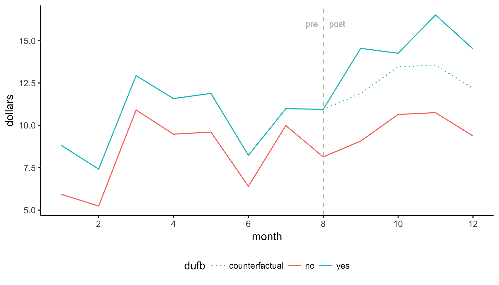

# DRAFT Dissertation Prospectus
Danton Noriega  
`r format(Sys.Date(), "%B %d, %Y")`  

#

<!-- Chapter 1 is an evaluation of the effectiveness of the Double Up Food Bucks program. "Effectiveness" will be defined by the change in total sales and volume of produce sold within a subset of grocery stores that implement Double Up (treatment group). The control group comprises 15 stores where Double Up was not implemented. A regression discontinuity design and difference-in-differences, between stores using Double Up (treatment) and those without (control), will be used to measure the size of the effect.

Improving health and food equity of SNAP participants is the broader policy concern. The mechanism is a financial incentive---Double Up Food Bucks---designed to increase fruit and vegetables consumption. A comparison will be made with another financial incentive program called the *Healthy Incentives Pilot* (HIP). I will argue how and why an evaluation of the Double Up program is an important addition to the current literature.
 -->
<!-- 
Chapter 2 is an exploration of how the basket of products purchased by SNAP shoppers changes after the introduction of DUFB. This will use a few different sets of data where one is able to link purchases to individuals.

Chapter 3 is a descriptive paper on how Durham Social Services spends emergency assistance dollars, such as Temporary Assistance for Needy Families (TANF). There is no uniformity between how different states and local governments use TANF funds. There is also little published data research. -->

<!-- ## Other Ideas {-}

1. **What is the redemption rate of Double Up coupons?**
    - Double Up coupons are, in effect, free money that can be used on ANY produce conditional on the prior purchase of Michigan produce
    - Under the assumption that consumers are rational and utility maximizing, we would predict a relatively high redemption rate; consumers would not leave free money on the table
    - This is unlikely to be the case but the question is, *just how high (or low) is the redemption rate?* Do most coupons go unredeemed?
    - This will be a technically difficult problem as we do not have panel data but the data could still be used to attempt to answer this question
2. **What purchasing behavior distinguishes Double Up participants from non-Double Up participants?**
    - Households have already self-selected into Double Up and non-Double Up. do their purchasing patterns differ substantially?
    - Is it possible to identify a Double Up purchase if we remove Michigan Produce?
    - This will depend a lot on how frequently Michigan produce is purchased without Double Up; otherwise, MI produce purchases will be a perfect predictor of Double Up transaction.
3. **How does the snap benefit cycle affect purchasing patters.** 
    - This is an attempt to model the consumption cycle of SNAP participants who receive benefits under the MI benefits schedule. The neoclassical assumption is *consumption smoothing*. The data displays different behavior---something more hyperbolic, with benefits being consumed at a high rate soon after being received. The two models---neoclassical and hyperbolic---will be constructed then calibrated using transaction data from 3 independent stores in MI where we can identify SNAP transactions.
 -->

<!-- # Literature Review {-} -->

<!--chapter:end:index.Rmd-->

# An Evaluation of the Double Up Food Bucks program {#chapter-1}

## Introduction {#intro-1 -}

Chronic conditions like obesity, heart disease, and other metabolic risk factors (stroke, type II diabetes, etc.) are estimated to cost the US health care system between 200 to 400 billion dollars annually [@cawley_medical_2012; @chatterjee_checkup_2014]. More importantly, these diseases account for hundreds of thousands of deaths each year. Heart disease alone is the leading cause of death for all persons in the US, with stroke fifth and diabetes seventh [@national_center_for_health_statistics_health_2015]. Diet is closely linked to these conditions, particularly obesity and cardiovascular disease. There is strong evidence that a diet high in (1) vegetables, fruits, nuts, unsaturated oils, fish, and poultry, but low in (2) red and processed meat and sugar-sweetened foods and drinks, helps lower body weight, blood pressure, and the risk of cardiovascular disease [@mente_systematic_2009; @nutrition_evidence_library_series_2014]. Improving the diet of Americans has therefore become an increasing priority for the United States, especially for struggling families that participate in the Supplemental Nutrition Assistance (SNAP) program.

SNAP is a federal aid program administered by the Food and Nutrition Service (FNS), an agency of the U.S. Department of Agriculture (USDA). At 74 billion dollars in FY2015 with roughly 45.8 million participants, it is the largest food assistance program in the US [@usda_fns_supplemental_2016]. To be eligible for SNAP, a household must be sufficiently budget constrained that hunger is considered likely without assistance. Eligibility is a function of countable resources, vehicle ownership and value, household size, gross or net monthly income, household composition, and meeting certain work requirements.^[For more details, visit http://www.fns.usda.gov/snap/eligibility] Some eligibility requirements vary by state, but in general, a family with less than $2000 in countable resources, where the adults work at least part-time earning a gross (net) monthly income at or below 130% (100%) of the federal poverty line, is eligible to receive SNAP benefits. Aside from a few restrictions---no alcohol, tobacco, non-food items, read-to-eat meals, or hot foods---households can use SNAP benefits to purchase any foods that will be prepared and consumed at home. Unfortunately, the purchasing patterns of the average SNAP household are not conducive to a healthy diet.

Research on the dietary patterns of households receiving SNAP benefits has found that they are significantly *less* likely to meet USDA dietary guidelines than the average US household and much *more* likely to consume unhealthy foods [@andreyeva_dietary_2015; @nguyen_supplemental_2015; @wolfson_fruit_2015]. A smaller set of research has found that SNAP households, at best, consume same amount of unhealthy foods (e.g. sugar-sweetened beverages, baked goods, snacks, candy, etc) compared to SNAP-ineligible households [@todd_caloric_2014; @hoynes_snap_2015]. In other words, SNAP households consume foods that are less healthy or about the same as SNAP-ineligible households. This is a concerning result given that most US households, regardless of income, already purchase and consume far too much meat and foods rich in sugars and fats, and far too few fruits, vegetables and whole grains [@usda_scientific_2015; @frazao_high_1999]. However, the purpose of SNAP is to keep struggling families from going hungry, not to ensure they consume the best possible diet. SNAP is designed to act like cash, helping families access more food than they could otherwise do so without assistance [@hoynes_snap_2015]. It is therefore not a failing of the SNAP program if benefits are used to purchase unhealthy foods. 

The SNAP program could be change such that it could continue satisfying its role as an anti-hunger program while simultaneously encouraging healthier purchases. @blumenthal_strategies_2014 and @leung_qualitative_2013 both surveyed a field of stakeholders and policy experts in the SNAP program about what they would do to improve the dietary quality of purchases. In both studies, restricting the purchase of unhealthy foods (e.g. sugar-sweetened beverages) and promoting healthy purchases through monetary incentives were the two most popular improvements (i.e. ranked the highest or most often suggested).^[It should be mentioned that there were other, less popular recommendations, such as modifying how SNAP benefits are distributed and improving nutrition education. For more details, see @blumenthal_strategies_2014 and @leung_qualitative_2013].

One common suggestion is to restrict the SNAP program to the same set of eligible foods as the Woman, Infants, and Children (WIC) program [@dinour_food_2007]. The WIC program provides food vouchers which limit households to a select group of food products. These food products are specifically selected to ensure women and their children receive nutritious, healthy foods. In other words, the WIC program, by design, places restrictions on food choices by defining a list of *eligible* items, as opposed to the SNAP program, which defines a list of *ineligible* items. Another common, and simpler, suggestion is to expand the existing list of ineligible items (e.g. alcohol) with products that are unambiguously lacking in nutrition and easy to identify, like soda or candy. New York City, for example, attempted to ban the purchase of sugar-sweetened beverages, and the state of Maine attempted to restrict the purchase of sodas, candy, and any other taxable food items [@gundersen_snap_2015]. Both restrictions were overturned by the USDA.

There are problems with "improving" the SNAP program by implementing even greater purchasing restrictions. First, there is no reason to believe that such a restriction would work. The restriction assumes that, under WIC-like requirements, households will substitute healthy foods for unhealthy foods when using SNAP benefits. What would most likely happen is that households would shift to purchasing unhealthy foods with cash. Second, such restrictions would likely lead to a drop in SNAP participation [@gundersen_snap_2015]. Restricting choice is a paternalistic policy that would further stigmatize SNAP participation. It would give the impression that SNAP beneficiaries are assumed to have worse diets and that they cannot be trusted to make healthy food purchases. Participation would also drop due to increased transactions costs of purchasing items with SNAP. Not all stores would clearly mark which items were SNAP eligible nor should participants be expected to remember. The result would be longer, more frustrating shopping trips. Lastly, it is important to remember that for many SNAP recipients, freedom of choice is what makes the SNAP program popular and easy to use [@edin_snap_2013].

The most popular "improvement" was providing a monetary incentive to SNAP participants for purchasing healthy foods [@blumenthal_strategies_2014; @leung_qualitative_2013]. Monetary (or financial) incentives, in this context, tend to be a rebate or voucher awarded to SNAP households for using their benefits to buy certain healthful foods, generally mineral-rich and nutrient-dense fruits and vegetables (i.e. leafy greens but not white potatoes). These monetary incentives for buying "targeted" fruits and vegetables (aka TFVs) are exclusive to SNAP participants. Much like a grocery stores loyalty card or a student ID card, retailers can "discriminate on price" (aka "target the incentive") using SNAP Electronic Benefit Transfer (EBT) cards to identifying eligible participants. Monetary incentives in the food retail environment are popular for two main reason. First, the framing of the "improvement" is positive. Instead of "punishing" SNAP participants through paternal restriction or disincentives (not covered), monetary incentives reward participants for healthy shopping behavior [@gundersen_snap_2015]. Retailers also prefer the positive framing of monetary incentives. For the moment, monetary incentives programs for SNAP participants are not wide spread. Therefore, taking up an incentive program, assuming the cost of implementation isn't too expensive, creates an opportunity for retailers to differentiate themselves from their competitors [@hartmann_corporate_2011]. The second reason is a strong theoretical framework established by neoclassical economics supporting incentives as an effective mechanism for changing human behavior. In practice, however, incentives have had mixed results, but there is building evidence that incentives may work in the food retail space. 

How, why, and to what effect incentives may encourage SNAP participants to purchase more targeted fruits and vegetables will be discussed in detail below, and is the motivating question behind this paper.

### Financial Incentives to Encourage Healthy Food Purchases {-}

Encouraging healthy behavior through financial incentives has a long history. Results are mixed. For example, financial incentives have been shown to help individuals commit to regular exercise, improve dieting, increase weight loss, and to quit smoking, but the intended effect of the financial incentives were often only short-term (see @gneezy_when_2011 and @cawley_economy_2015 for an overview). @gneezy_when_2011 also explain, through a review of the literature, that depending on the context and design, incentives can backfire, producing an effect known as "crowd out". Crowd out occurs when an incentive displaces the intrinsic reward of a behavior (originally defined for "prosocial" behavior, like volunteering or giving blood; see @benabou_incentives_2006). The behavior then becomes dependent on the extrinsic reward. As a result, having shifted from being intrinsically rewarding to extrinsically rewarding, the positive behavior continues only as long as the monetary incentive is provided. More significantly, the intrinsic reward of the behavior does not return once it has been "crowded out". Therefore, the long-term effect of a monetary incentive can be negative, despite showing positive effects in the short-term. That said, incentives can produce successful long-term results if they are instead used as a mechanism to build good habits. This requires that the incentives be salient and produce immediate feedback without neglecting behavioral findings such as loss aversion and mental accounting [@john_financial_2011].

Given the research on incentives, it is reasonable to assume that a monetary incentive for SNAP participants to purchase healthy foods, like fruits and vegetables, may fail or even backfire. Should the act of purchasing healthy foods be intrinsically rewarding to SNAP shoppers, introducing an incentive may produce a "crowd out" effect. However, recent field experiments find that incentives can establish healthy food choice as a habit, possibly overriding any crowd out. Daily incentives encourage children to make healthier food choices in school lunchrooms, who in turn develop positive, long-term food habits [@loewenstein_habit_2016; @list_behavioralist_2015; @belot_incentives_2014]. Outside of the school lunchroom environment, @list_incentives_2015 found that similar habit formation is possible with incentives in a more traditional food retail environment. In their experiment, @list_incentives_2015 provided an incentive to 222 shoppers ($1) to use their rewards cards, but then randomly assigned each participant to the control group to one of three interventions: *information*, *incentive*, or *combination*. The *information* treatment was a flyer with tips on how to prepare fruit and vegetable dishes as well as the health benefits of eating more fruits and veggies. The *incentive* was an additional dollar for every 5 cups of targeted fruits and vegetables (TFVs) purchased. The *combination* treatment group included both. The intervention lasted for 5 months but each group continued to be observed for roughly 6 weeks months after. The *information* intervention had no effect, but the *incentive* and *combination* interventions on average doubled their purchase of fruits and vegetables in comparison to the control group. Most promisingly, the gap persisted with minimal shrinkage for 6 weeks following the end of the intervention. However, there was no follow up after the 6-week post-intervention period. It is therefore possible the gap closed over multiple months (as opposed to multiple weeks).

The design, food environment, and target of the incentive in each of these experiments is important. First, the incentive in these experiments is designed to be salient and immediate. In the school lunchroom experiments, the children are aware of the incentive and receive the reward (e.g. a small token) immediately after selecting the healthy food item. Likewise, the shoppers received their additional $1 reward for every 5 cups of TFVs at checkout. One distinction between the designs is frequency. The children are exposed to the incentive every school day in the lunchroom experiments. The shoppers, on the other hand, were exposed as frequently or as infrequently as they chose. This distinction is important, as the latter better reflects the experience of shoppers using the SNAP benefits. Second, the food environment is important because it determines what choices are available. The children have a finite set of options in the school lunchroom and they also have no outside option (besides not eating lunch). The children optimize on a relatively small set of choices and, for the duration of the intervention, the incentive always existed. Food retail environments are drastically different. There are numerous competing food choices and generally other outside options.^[It should be noted that this is not always the case. In @list_incentives_2015, for example, the store that was selected for the experiment was one of the few places local shoppers could find fresh produce. The store itself was located in one of Chicago's poorer neighborhoods.] It is substantially more difficult for the shopper to optimize over such a large set of choices. Last, and most obviously, one set of studies targets children, the other adults. A priori, we would expect a monetary incentive to affect children differently than adults. The fact that habit formation through incentives appears possible for both target groups is promising. 

Research where SNAP participants are the target group is nascent. The USDA's Food and Nutrition Services (FNS) ran the first large scale randomized control trial investigating the impact of a financial incentive for targeted fruits and vegetables in 2011. The experiment was called the Healthy Incentives Pilot (HIP). HIP is the precursor to every incentive program currently being funding by the USDA. It also provides the data for the few papers recently published on incentives for SNAP participants.

### The Healthy Incentives Pilot {-}

A brief overview of the Healthy Incentives Pilot is necessary to provide context to, and contrast with, more recent financial incentive programs.

The UDSA's Food and Nutrition Services designed the Healthy Incentives Pilot. The pilot was funded by the Food, Conservation, and Energy Act of 2008 to test whether financial incentives would increase consumption of targeted fruits and vegetables (TFVs). SNAP participants were the target group.

HIP was designed as a large scale randomized control trial (RCT). FNS partnered with the Massachusetts Department of Transitional Assistance to implement HIP. The pilot lasted from early 2011 to the end of 2012. The population included all 55,095 SNAP participants in Hampden County, MA. Hampden County is the poorest county in Massachusetts and has the highest rates of obesity and other diet-related chronic illness (e.g. type 2 diabetes).

Of the 55,095 SNAP participants, 7,500 were randomly assigned to the treatment group. The remainder fell into the control group. The treatment was a 30 cent (or 30%) rebate on every dollar spent on TFVs. The rebate was capped at $60 per month. To receive the rebate, selected SNAP participants had to use their EBT cards at participating retailers. The rebate, which was returned to their EBT account, could then be used on any food item. That is, the rebate could only be earned buying TFVs, but could be redeemed buying any SNAP eligible food item. Most HIP participants spent about $12 a month on TFVs, earning an average of $3.65 per month in rebates---drastically lower than the $60 per month rebate cap.

The evaluation was conducted using 24-hour dietary recall surveys. A total of 5,000 participants were selected to be surveyed, even split between treatment and control (2,500 HIP, 2,500 non-HIP). The first survey was conducted prior to the start of the pilot. This established a baseline. The second survey occurred 4 to 6 months in to the pilot and the third survey occurred 9 to 11 months in. (The variation, e.g. 4 to 6 months, was due to the treatment being implemented in 3 waves of 2500.)

The evaluation found that the 30% rebate lead to about a 26% increase in consumption of TFVs. This was equivalent to about 0.24 cups of TFVs. Roughly 60% of the increase was due to increased vegetable consumption and 40% due to increased fruit consumption. The effect, in absolute terms (0.24 cups), seems small. But a $0.87$ price elasticity, relative to other results in the literature, is quite high---$0.7$ and $0.48$, on average, for fruits and vegetables, respectively [@andreyeva_impact_2010]. 

Despite some limitations and technical problems---underreporting on the 24-hour recall survey and system glitches early in the pilot (see pages 60 and 208-210 of @bartlett_evaluation_2014)---HIP was considered to be an overall success [@klerman_short-run_2014; @olsho_financial_2016]. It implemented on of the largest, most complex RCTs to isolate how incentives can increase household consumption of TFVs. It also provided a feasible model for nationwide expansion (assuming cost reductions due to economies of scale; see @an_nationwide_2015).

HIP also provides a framework for understanding how a financial incentive, expanded dramatically in one geographic area, could improve TFV consumption. But, as noted in the final HIP report, one of the most prominent retailers in Hampden County chose not to participate (page 61, @bartlett_evaluation_2014). Its third-party processor decided it was too difficult and too costly to implement the financial incentive on its point-of-sale technology. This strategic behavior by the retailer, which had a significant presence in Hampden County, impacted where participants could use the incentive.

Most financial incentive programs work at the local level, expanding non-randomly. We should anticipate certain retailers (firms) to behave strategically when participating in any of these incentive programs. Likewise, we should anticipate voluntary (non-random) self-selection by SNAP beneficiaries into these financial incentives programs. To this end, more research is needed to understand the impact of incentive programs under *real-world* conditions. HIP provided evidence that incentive programs can work, but barring state-wide or nation-wide adoption of point-of-sale financial incentives, we should expect growth to occur organically under non-experimental conditions.

An example of such a financial incentive program for SNAP participants is the Double Up Food Bucks program (DUFB or Double Up). The non-random expansion and impact of this financial incentives program will remain the focus of this paper

### The Double Up Food Bucks Program {-}

The success of HIP paved the way for the Food Insecurity Nutrition Initiative (FINI), established by section 4208(b) of the Agricultural Act of 2014 (aka 2014 Farm Bill). FINI---a 100-million-dollar initiative---in turn piloted numerous non-profit financial incentive programs aimed at improving the diets of SNAP participants. 

Of specific interest is Double Up Food Bucks (DUFB or Double Up), an incentives-based program funded by FINI. In 2009, the non-profit organization Fair Food Network (FFN) launched the Double Up Food Bucks program in Detroit, Michigan. The intention of the program was to get more low-income families visiting and participating in local Detroit farmer's markets. The mechanism for increasing participation was a dollar-for-dollar match of locally grown fruit and vegetable purchases. This subsidy was accessible only to low-income families receiving SNAP benefits, who could exchange up to $20 of their benefits for a wooden token that could be used on up to $40 worth of locally grown produce. 

The DUFB program was considered successful given it had expanded to more than 150 farmer's markets in 2014 from just 5 farmer's markets in 2009. SNAP benefits have been used more than 200,000 times to purchase fresh produce, with more than 10,000 first time SNAP customers visiting farmer's markets in 2013 alone [@fair_food_network_double_2014]. The program is considered by Fair Food Network to be a "three-fold" win given that the program helps local low-income families buy more fresh produce, provides new customers for local farmer's, and stimulates the local food economy. Relative to farmer's markets in other states, DUFB did seem to be bringing in substantially more SNAP dollars ($1.7 million in Michigan versus $307,000 in Illinois, the second largest). 

A 5.17 million dollar FINI grant was awarded to Fair Food Network to help it pilot three adjustments to the Double Up Food Buck program [@usda_nifa_usda_2015]. First, FFN needs to test DUFB as a year-round program in select locations instead of the current seasonal format. Second, shift away from the token system to providing DUFB electronically at point-of-sale. Third, the DUFB needs to expand from farmer's markets into other retail environments, like supermarkets and grocery stores. 

Successful expansion into supermarkets and grocery stores is critical. Approximately 80% of all SNAP benefits in 2015 were used in supermarkets or super stores [@usda_fns_snap_2016]. Less than 1% percent of SNAP benefits were used at local farmer's markets. The amount of SNAP benefits used in local farmer's markets has increased since 2009, but no where near the growth necessary to reach the type of stores most frequented by low-income families. If localized financial incentive programs like DUFB are going to be considered one of the USDA's many tools to increase food access and combat obesity, then they must be successfully implemented and scaled across supermarkets and grocery stores. Most importantly, incentive programs like DUFB must prove they are effective in changing purchasing habits within supermarket/grocery store food environments. 

### Double Up Food Bucks vs the Healthy Incentives Pilot {-}

There are notable differences between DUFB and HIP that make the evaluation of DUFB more difficult. In short, HIP was implemented as an RCT. DUFB implementation is not. Let's explore in greater detail.

HIP had substantially more participating stores, all within the same county (Hampden County, MA). DUFB has fewer participating stores, spread across many different counties, and across many different grocery store chains. Therefore, the probability of a SNAP shopper in Hampden County having walked into a HIP participating store was much higher than a SNAP shopper walking into any DUFB participating retailer.

The incentive delivery mechanisms also differ. First, all SNAP beneficiaries who shop at a DUFB participating store receive the benefit automatically. In other words, SNAP households that patron a store with DUFB receive the incentive regardless of their intentions or awareness of the DUFB incentive. Therefore, evaluating DUFB has the added difficulty of identifying which shoppers are optimizing in response to DUFB, as opposed to shopping normally. In contrast, SNAP households assigned to the HIP treatment group were made aware of incentive and were eligible to use it (even if they didn’t quite understand how the incentive program worked — see @bartlett_evaluation_2014). Households in the control group were not aware of the incentive and were not eligible to use it. And because participants were assigned, HIP evaluators could identify treated participants from control participants. 

Second, the DUFB financial incentive is substantially larger but more restrictive. The DUFB incentive is a dollar-for-dollar match of locally grown produce purchases capped at $20 per day. The matched dollars are accrued as points on a store loyalty card. Existing points are then automatically redeemed as dollars on *any* fresh produce purchases, not just locally grown produce. In comparison, the HIP financial incentive was a return of 30 cents per dollar spent on TFVs which could be spent on *any* food item. That is, the DUFB incentive doubled the purchasing power of every dollars spent on TFVs *only for more TFVs*; the HIP incentive increased the purchasing power of every dollars spent on TFVs by 30% *for any SNAP eligible food item*.

Finally, the experimental designed of HIP allowed researchers to form a causal interpretation of their results; the average treatment effect is the same as the average treatment effect on the treated. Any difference in the purchase and consumption of TFV between the treatment and control groups could therefore be attributed to the incentive. This is not the case for DUFB. However, HIP implementation is the exception. How DUFB, and similar financial incentive programs are implemented, is the norm. The contribution of this paper will be evaluating and understanding the impact of DUFB, given that DUFB and similar programs are implemented in the "real-world" (non-experimental conditions) 

### Evaluating Double Up Food Bucks in Non-experimental Conditions {-}

DUFB’s expansion and implementation into supermarkets and grocery stores did not follow an experimental design. Fair Food Network searched for local partners in the Detroit area willing to participate in DUFB. Not all grocery stores, especially the smaller independent stores, had the capacity to implement the point-of-sale technology necessary for the incentive---even if FFN offered to help cover the upgrade costs. The result is a self-selected group of stores participating in DUFB. This, in some ways, parallels what occurred in HIP, where one of the largest retailers decided integrating their point-of-sale systems to include the incentive was too expensive. This type of strategic firm behavior is important to consider, even if complicates the evaluation of an incentive program like DUFB. 

In the real world, stores seek to maximize profits and will opt to participate only if they expect to profit. Similarly, individuals will self-select into participating; participation is optional and more likely to occur with well-informed and motivated SNAP shoppers. Selection, in this case, is a feature, not a flaw, of such incentive programs when implemented by non-profits or policy makers. The evidence, thanks to HIP, exists that incentives can lead to an increase in consumption. The goal of this paper is therefore to accurately measure the effect of the DUFB on TFV purchases while taking the selection into account. That effect can then be extrapolated forward, albeit weakly, using the results of HIP, to measure changes in consumption.

Fair Food Network started testing and gathering data from grocery stores implementing DUFB in 2014. One of FFN's largest partners, a Michigan grocery retail and distribution company, piloted the program in 2 of its stores in 2014. The company has since expanded to 5 stores in 2015 and then to 17 of 62 stores in 2016. Rapid scaling was possible due to the point-of-sale technology used by the company to implement DUFB across its stores. It provides, to date, the best case study of a firm strategically scaling DUFB across numerous grocery stores that span different geographic areas and populations.

All transaction data from 2014 - 2016 will be provided for every store that has, at any point, participated in DUFB. These data are complete (i.e. no records have been removed) and at the item level. A complete set of data will also be provided from another 15 stores where DUFB was not implemented. 

Currently, no research exists evaluating DUFB, or similar incentive programs, using a complete set of store transaction data. HIP, for example, only had transactions records for SNAP EBT cards. Transactions, should a different tender be used by the same individual, could not be observed. Therefore, these data provide an unprecedented opportunity to analyze how the DUFB financial incentive performs under real-world conditions. This paper will be, to the best of my knowledge, the first to perform an evaluation of a financial incentive, targeted at SNAP participants, using a complete set of data, from multiple stores, across multiple years, and collected under non-experimental conditions.

<!--chapter:end:01.10-introduction.Rmd-->

## Data {#data-1 -}

These data come from a large grocery distributor and retailer serving multiple grocery chains. Three years of data will be made available, 2014 through 2016. To my understanding, this includes months where the DUFB incentive is active (Aug 1 to Dec 31) and inactive (Jan 1 to July 31) across all stores. These data are transaction level data and will include (at least) store number, register, transaction ID, date and time of purchase, payment type, item, dollars, and quantity.

Double Up implementation was considered for a single grocery chain. The chain has more than 60 stores, 17 of which were selected as "treatment" stores (with Double Up). Of the remaining stores, data is being made available from an addition 15 to serve as "controls". The quotes here signify that these terms will be used as shorthand, but the terminology is somewhat misleading. The use of "treatment" and "control" could lead one to think store assignment was random. It was not.

[MISSING real specific details about the data e.g. total transactions observed etc.]

**Data Not Linked to Individuals**

One important variable that will not be made available is a variable for loyalty card numbers. The company's use of loyalty cards across its many chains was an exciting prospect. Previous transaction data from smaller independent grocery chains had no way linking purchases to a single unique identifier over time because these smaller chains did not have advanced point-of-sale systems.

In earlier conversations with the company, it was understood that loyalty cards would be made available. However, months into working with the company, I was informed that this was no longer possible. Per the company's legal department, the company cannot share any personal information about their customers. Unfortunately for us, in the loyalty card contract signed by customers, the loyalty card number itself is considered personal information, meaning loyalty card numbers fall under the same legal category as phone numbers and home addresses.

**DUFB Incentive Inconsistency Across Years**

The retail company informed us that the way the DUFB incentive worked in 2016 is distinct from 2014 and 2015. The DFUB incentive in 2016 worked by accruing points for each dollar spent on *locally grown* fresh produce. (Recall that each point is equal to one dollar.) Points are then redeemed automatically on *any* fresh produce. However, in 2014 and 2015, the incentive was the *opposite*. In those two years, the DUFB incentive worked by accruing points on *any* fresh produce, automatically redeeming points on *locally grown* fresh produce. 

This is important because *locally grown* fresh produce is a much smaller subset of the *any* fresh produce. Therefore, in years 2014 and 2015, shoppers could easily accrue points but had a constrained set of produce on which to redeem points. In any case, estimates of the incentive for the year 2015 cannot be compared to estimates in the year 2016.

**Other Information**

*Past Experience with Similar Data*

This is not my first experience working with transaction data. At this point, I have more than 3 years working with transaction data. Furthermore, this is not my first experience with transaction data where (1) DUFB was implemented and (2) transactions were not linked to individuals.

I performed an analysis in April of 2016 for FFN using 5 months of transaction data from 3 small Detroit-area grocery stores. Figure \@ref(fig:trx-cycle) was produced with those data. It was easy to distinguish when SNAP benefits were being used in those data. Likewise, it was easy to tell when transaction made use of the DUFB incentive (either an issuing of DUFB or a redemption). A simple aggregation could determine the total amount of dollars spent per some unit time (*day* was the smallest possible unit of time). I expected data for my prospectus will be very similar. The empirical models in the next section were developed under these expectations of the data.

*SNAP Spending is Cyclical*

In some prior work, I've observed that SNAP spending is cyclical, peeking in the 2nd week. This is due to the state's monthly SNAP benefits transfer schedule. Benefits are distributed every odd day of the month between the 3rd and 21st. Each day maps to the digits `0` through `9`. SNAP participants receive their benefits once a month on the day corresponding to the last digit of their SNAP ID number. For example, ID numbers that end in `0` receive their benefits on the 3rd of each month. SNAP EBT benefits are spent quickly. As a result, there are always fewer SNAP purchases during the 4th week of the month. And fewer SNAP benefits means fewer transaction capable of receiving the DUFB incentive. I'm not yet sure what impact this will have on my analysis this time around, but I thought it important and interesting to point out and consider.

The week-to-week cyclical pattern of SNAP EBT spending can be observed in Figure \@ref(fig:trx-cycle). (Note that these are from a different data source and different store chain, but from the same US state.) At the start of the each month, SNAP EBT transactions (red line) increase until peeking at the second week. The count then declines steadily through the 4th week before once again spiking during the 1st week of the following month. (Ignore the green line; these are DUFB counts from a different data set.)

(\#fig:trx-cycle)Example of how SNAP EBT benefits are spent in a predicable, week-to-week, cycle. It is the result of how benefits are distributed (uniformly across the first 3 weeks) and of how most SNAP participants spend their benefits (quickly and soon after being received). The red line is the count of transactions where SNAP EBT benefits were used as tender. Ignore the green line.

*Concerns*

One concern I had was if local supply of produce differed geographically across the state where the stores are located. The company representative told me that should not be a factor because all stores are supplied from the same warehouse. Therefore, in theory, each store should have the same local produce. I plan to visit the stores on a later date to confirm that this is actually the case.

<!--chapter:end:01.20-data.Rmd-->

## Overview of Store Selection and Expansion {#store-selection-1 -}

How the 17 "treatment" stores and 15 "control" stores were selected in 2016 is important. First and foremost, selection was *not* random. Stores were either selected by the company (13 of 17) or self-selected into Double Up (4 of 17). Second, the 15 control stores were selected *after* the selection of the 17 treatment stores. Data from all remaining stores was requested but the request was denied; only 15 stores had been approved by the company's management. Finally, and most importantly, the selection criteria for the 17 treatment stores is *observable*. The implications of this will be covered in more detail in the [Methods](#methods) section.

### Selection and Expansion of Double Up Stores {-}

The first 2 stores were piloted with Double Up in 2014. Both were in geographically distinct areas (these will be referred to as "`Node 0`" and "`Node 1`"). There was a small expansion adding 3 more stores in 2015. The 3 stores were selected because they were geographically close to the 2 original pilot stores (2 close to `Node 0`, 1 close to `Node 1`). The 5 stores are referred to as the "core". The location of these 5 stores, separated in two clusters, established the geographic constraints that were then used to determine most of the additional stores in 2016.

Double Up was expanded to 12 more stores in 2016, totaling 17. Of those 12, 6 were selected due to their proximity to the 5 core stores, their SNAP EBT^[Electronic Benefit Transfer.] sales figures, and similarity in surrounding demographics (high population density, more African-American). In other words, 9 of the 17 stores---excluding the initial 2 pilot stores—--were selected on a set of *observable* characteristics. The remaining 6 stores were not.

Of the remaining 6 stores, 4 asked if they could be included in the program. These stores *self-selected* into Double Up, making these stores fundamentally distinct. They were considered, and then included, only because they fell within the "Top 50". The final 2 stores were selected by the company for "strategic business decision". The best interpretation of this is that the company thought that Double Up would provide a competitive edge to the 2 included stores given some internal calculus. How the company came to this decision is *unknown* and therefore *unobserved*.

Table \@ref(tab:store-class) helps understand the year by year expansion of Double Up. Stores are classified as either `assigned`, `self-selected`, or `unobserved`. To be `assigned` means a stores participation in Double Up was determined (assigned) by the company; `self-selected` means the store asked the company to participate; `unobserved` means that the company selected the store to participate in Double Up but for unknown and unobserved reasons. Numbers were assigned to each store for easy reference but otherwise have no meaningful interpretation.

Table: (\#tab:store-class)Year by Year Store Selection. Stores 1 and 2 represent the initial 2014 pilot stores.

 Store  2014    2015       2016          
------  ------  ---------  --------------
     1  pilot   pilot      pilot         
     2  pilot   pilot      pilot         
     3          assigned   assigned      
     4          assigned   assigned      
     5          assigned   assigned      
     6                     assigned      
     7                     assigned      
     8                     assigned      
     9                     assigned      
    10                     assigned      
    11                     assigned      
    12                     self-selected 
    13                     self-selected 
    14                     self-selected 
    15                     self-selected 
    16                     unobserved    
    17                     unobserved    

### Expansion on Observables {-}

An example expansion on *observables* (using fake data) can be seen in Figure \@ref(fig:dufb-expansion). In the top frame, one can see two blue dots. These blue dots simulate the first two pilot stores in 2014. The left blue dot is `Node 0` and the right blue dot is `Node 1`. The gray zones represent areas of higher population density. Dark gray is considered *urban*, defined as having a population density of 1500 persons or more per square mile. The light gray are small towns and cities, more densely populated than very rural areas, but could not be considered *urban*. The expansion in 2015 (middle frame) proceeds to the stores closest to the original pilot stores. The expansion continues to 6 more stores in 2016 (bottom frame) away from the nodes but also along areas of higher population density.

Not conveyed in Figure \@ref(fig:dufb-expansion) is that the 2015 and 2016 expansions also move through stores that happen to be "highly ranked"---that is, have relatively higher SNAP EBT sales.^[All stores within the chain were ranked by SNAP EBT sales as a percentage of total sales.] Also not conveyed is the fact that there is a strong correlation between geography, population density, racial composition, and SNAP EBT sales. The 2015 expansion to the most nearby stores also meant that it was an expansion to stores with high SNAP EBT sales in densely populated, African-American neighborhoods. The 2016 Double Up expansion was more explicit given that set of feasible stores substantially increases as one moves away from each node. Double Up stores were thus specifically selected not just by geographic proximity, but also by SNAP EBT sales ranking and demographic compositions similar to the initial 2014 stores.

(\#fig:dufb-expansion)Example expansion over time from 2014 to 2016 (top to bottom) using fake data. Blue dots denote stores with Double Up, pink dots denote without. Gray sectors denote higher population density. The initial nodes can be seen in the top (2014) frame.

<!--chapter:end:01.21-expansion.Rmd-->

### Selection of Control Stores {-}

Ideally, all remaining stores would have been available to use as a control group but the company only approved that data be released for 15 stores. This left the added---and incredibly important---step of selecting the control stores since the company approved, but did not explicitly select, the 15 stores.

Selecting the control stores proceeded in two steps. First, stores that either self-selected or were selected using some unobservable criteria were matched using *Coarsened Exact Matching* (CEM) [@iacus_causal_2011]. Second, stores assigned Double Up were pooled with nearby control stores and then scored using a linear probability model. Each step is explained in detail.

*Step 1: Coarsened Exact Matching*

The 6 stores classified as `self-selected` or `unobserved` (stores `12` through `17`; see Table \@ref(tab:store-class)) were compared against all possible control stores for matches. Matching was done across 5 dimensions: race, income, population density, store attributes, store EBT sales. One variable per dimension was selected: percentage of population that is African-American (zip code level); people per square mile (zip code level); median income for people who have received SNAP or similar assistance (zip code level); the number of associates employed in each store; and the percentage of total stores sales attributed to EBT/SNAP.

Of the 6 stores (stores `12` - `17`), only 3 produced viable matches. However, each of the 3 matched stores had matched to more than one control stores. The closest stores, by driving distance, were selected as the tie-breaker for each matched store. Stores were sufficiently far apart, with very sparsely populated areas between, that "spill-over" was considered unlikely. That is, it is considered unlikely that a shopper near a store without Double Up would opt to drive 30 or more minutes to shop at the store *with* Double Up.

This left 12 stores to be allotted to the control group and 3 treatment stores to be effectively discarded.

*Step 2: Scoring via Linear Probability Model*

Assignment to treatment and control can be perfectly determined since we know and observe the criteria used for assignment: geographic distance from an initial store (node), SNAP EBT sales rank, and demographics---specifically population density and percentage African-American. A scoring function was created by fitting a linear probability model to all stores within 140 kilometers of the two initial pilot stores.

$$
\begin{aligned}
  \bm{s}  &= \widehat{P(\mathbf{D} = 1 | \bm{X}, \bm{N})} \\
          &= \mathbf{X} \bm{\hat \beta} + \hat \alpha \mathbf{N} + \left (\mathbf{X} \odot \mathbf{N} \right ) \bm{\hat \gamma}
\end{aligned}
$$

$\bm{s}$ are the fitted values of the estimated linear probability model; $\mathbf{D} \in \{0,1 \}$ is a $n \times 1$ vector of store assignments to Double Up; $\mathbf{X}$ is an $n \times k$ matrix of normalized observable covariates that determine assignment; $\mathbf{N} \in \{0, 1 \}$ is an $n \times 1$ dummy vector denoting the closest pilot store aka "Node", where $0$ is `Node 0` and $1$ is `Node 1`. $\odot$ represents element-wise multiplication aka "Hadamard product".

Stores were sorted by the fitted values of the model, $\bm{s}$. There is perfect separation between Double Up stores and those without (see Figure \@ref(fig:score-plot)). Therefore, the top 11 stores by score value are all Double Up stores. The next 12 stores by score value are then allotted to the control group.

(\#fig:score-plot)Store Score vs Double Up Assignment

<!--chapter:end:01.22-store-selection.Rmd-->

## Overview of Proposed Methods {#methods-1 -}

I will perform two separate analyses. This is a consequence of the store selection issue outline in the data section. The main analysis will be performed on the 9 *assigned* stores and 12 *control* stores.^[I'm excluding the 2 pilot store because they are never observed without DUFB.] In attempts to make use of as much data as possible, I will also perform a smaller analysis with the 3 *self-selected* stores matched using CEM. (Please see the [Data]{#data-1} Section and Table \@ref(tab:store-class)) for more about *assigned* and *self-selected* stores.)

Difference-in-Differences (DD) and Regression Discontinuity (RD) will comprise the main analysis. DD will be the only method for the second smaller analysis. I outline each analysis and its methods in the next section.

The unit of analysis will be the store, not the individual; the data cannot be linked to individuals. I assume the DUFB incentive, if effective, will have a store-level effect. That is, if a store's implementation of DUFB affects individual behavior, the effect should be measurable after aggregating over all observed transactions. My proposed analyses depend on this assumption but I am confident the effect will be measurable.

I propose two outcome variables. The first is the proportion of SNAP EBT dollars being spent or redeemed on fresh produce. If the incentive is working, then I should see in increase in SNAP EBT dollars spending on fresh produce. I'm certain this outcome variable will be available. I'm not so certain about the second outcome variable, the total quantity of fresh produce purchased. This depends on whether weight or quantity is included in the data. This will depend on UPC matching. UPCs will be possible, but matching to UPC databases is not always precise. Should matching be poor, discerning what a product is, its weight, etcetera, will be difficult, making the second outcome variable unreliable.

### Main Analysis: Regression Discontinuity (RD) {-}

In the [Store Selection](#store-selection-1) section, I discussed the construction of the score function $\bm{s} = \widehat{P(\mathbf{D} = 1 | \bm{X}, \bm{N})}$. Given $i = 1,...,n$ stores, the score of each store can be determined via observable data, $s_i = \widehat{P(D_i = 1|\bm{x}_i, n_i)}$. These scores, when ordered, produced perfect separation between treatment stores and control stores (see Figure \@ref(fig:score-plot)).

An RD design requires a *running variable* where, above some value $c$, the probability of being assigned to the treatment group is $1$. Assume I make the score function $\bm{s}$ my running variable such that $D_i = \bm{1}[s_i \ge c]$.

In my case, assignment $D_i$ is determined by $s_i$ by construction. Recall that $s_i$ is a function estimated on observable covariates. These are the same observable covariates the company used to determine assignment for a subset of stores. I used a linear probability model to estimate the score function and the estimated model perfecty predicted assignment. I then ordered stores by their score value and selected the next 12 unassigned stores.

This problem is that I do not actually know $c$. I only know that $c \in (0.50, 0.64)$. The light gray band in Figure \@ref(fig:score-plot2) displays the possible values of $c$. The problem, in essence, is that I do not have---and never will have---enough stores, so I'm lacking density around where the separation occurs. 

(\#fig:score-plot2)Store Score vs Double Up Assignment with Uncertainty Band (light gray)

I propose to estimate the RD design using various values of $c$. The perpetual gap means any model estimate to the left or right of some $c_0 \in (0.50, 0.64)$  will have to be extrapolated up to $c_0$.

**Set-up**

The outcome of variable for each store will be the *average amount spent on locally grown produce in a SNAP transaction per day*. The timeframe will be August - December (months $8$ - $12$) of 2016, when the DUFB incentive is place. I decided on using days as the unit of observation to increase the sample amount of data for estimating. I expect there to be enough transactions per day for this to be possible.

Let $y_{i}$ represent the outcome variable where $i=1,...,n$ denotes stores. Let $c$ denote the cutoff; $s_i$ the score computed for store $i$; and $D_i$ the assignment variable. Each draw (or row) of data for store $i$ is a vector $(y_i, s_i, D_i)$ corresponding to a single day. Recall that $y_i$ is a point statistics estimated using a single days worth of transaction data for store $i$. All days will be pooled, creating roughly $30\times5=150$ observations (days) per store.

Let $u_i$ be an error term assumed to be $\mathcal{N}(0, \sigma^2)$.

The RD model I propose is as follows

$$
y_{i} = \alpha + \rho D_i + \gamma (s_i - c) + \delta D_i(s_i - c) + u_{i}
$$

My hope is to produce a graph that looks like the following

[GENERATE EXAMPLE GRAPH. At each point $s_i$, there will be about 150 points drawn in vertical like. This would help visualize the distribution of average-dollars-per-day.]

### Main Analysis: Difference-in-Differences, Model 1 (DD1)

[WRITE MODEL. Below is example of DD model overtime.]

(\#fig:dd1-plot)Example DD Model over 12 months in 2016 (DUFB start month 8)

<!-- ### Main Analysis: Difference-in-Differences, Model 2 (DD2) -->

<!-- This model is some -->
<!-- The proposed model is as follows -->

<!-- $$ -->
<!-- \begin{aligned} -->
<!--   y_{ist}  &= \alpha_i + \beta_0 DUFB_{s} + \beta_1 POST_{t} + \delta (DUFB_{s} \cdot POST_{t}) + \sum_{j=1}^4 \theta_{j} I_{j}(t) + \epsilon_{ist} -->
<!-- \end{aligned} -->
<!-- $$ -->

<!-- where $y_{ist}$ is the outcome variable for store $i$ in state $s$ during week $t$. $\alpha_i$ captures any time-invariant store-specific effects. $DUFB_{s}$ indicates whether store $i$ has or will be part of the DUFB incentive. $POST_{t}$ indicates if week $t$ for store $i$ lands in a post- or pre-DUFB year. Recall, there are 3 years of data (2014 - 2016) and DUFB implementation is staggered across stores.  $I_{j}(t)$ captures any cyclical effects due to the monthly SNAP benefit transfer schedule. $I_{j}(t) = 1$ if week $t$ is the $j$th week of the month, where $j = 1,2,3,4$. -->

### Secondary Analysis: Difference-in-Differences with Matching {-}

Smaller analysis of the 3 stores that self-selected and were matched to 3 other stores. Total N will be 6. Likely that nothing will be significant. But need to be transparent.

<!--chapter:end:01.30-methods.Rmd-->

# Non-recurrent TANF spending in Durham County {#chapter-2}

## Introduction {#intro-2 -}

The Personal Responsibility and Work Opportunity Reconciliation Act of 1996 (aka "welfare reform") replaced the old welfare program, Aid to Families with Dependent Children (AFDC), with Temporary Assistance for Needy Families (TANF). TANF profoundly changed how states prioritize and spend government welfare dollars. The result has been a gutting of traditional cash assistance programs over the last 20 year. Cash assistance used to accounted for 70% of AFDC spending. Under TANF, cash assistance accounts for 26%, with ten states spending below 10% [@schott_how_2015]. Fewer and fewer dollars now reach families in poverty with each passing year [@cbpp_chart_2016].

The literature on the history and consequences of TANF over the past 20 years is vast.^[@ziliak_temporary_2015 provides a great overview on the history of TANF, including a great time line in the appendix. @blank_what_2007 provides a great overview of what has been learned 20 years on.] For this paper, I will spotlight the consequences of two welfare reform changes:

1. The transfer of administrative authority to county and city governments.
2. The reporting requirement for basic assistance. 

However, before doing so, it is important to understand how welfare was financed under AFDC and how it changed under TANF.

### Welfare Financing: AFDC vs TANF {-}

**Financing the AFDC Program**

The AFDC entitlement program was financed by a federal-state matching grant system where the federal government shared the marginal cost of every dollar spent on cash assistance by the states [@ziliak_temporary_2015]. State spending on entitlements was matched by the federal government at the Federal Medical Assistance Percentage (FMAP), which ranged between 50% and 83% [@falk_temporary_2016]. The FMAP matching rate was a function of a state's economy. This assisted and encouraged poorer states to spend money towards AFDC entitlements, even during an economic downturn.

The federal government, aside from helping fund AFDC, also determined eligibility requirements. Even though the states did have the option to extend some eligibility requirements, generally any impoverished mother caring for a child was eligible to receive AFDC benefits. Benefits, which came in the form of monthly cash assistance, had no work requirement between 1935 and 1967. In 1967, a small work requirement was added to received AFDC benefits, but beneficiaries were rarely sanction for failing to meet the requirement. Federal requirements shifted with passage of the Family Support Act of 1988 (FSA). FSA required mothers with children over the age of 3 to participate in an education, work, or training program to encourage a shift from welfare to work. States soon began requesting waivers to try their own welfare-to-work programs in place of AFDC [@blank_what_2007]. By 1996, waivers were approved for 43 states. Welfare reform, which ended the AFDC program, occurred soon after.

**Financing TANF**

TANF ended federal-state matching grant financing, replacing it with federal fixed block-grant financing. Federal TANF spending for block-grants is fixed at $16.5 billion and has been since 1996.

Block-grant welfare financing profoundly changed how states prioritize their spending. To receive a block-grant, states are required to spend their own funds on programs supporting one of four TANF purposes:

> C.F.R §§ 260.20 - What is the purpose of the TANF program?
> 
> The TANF program has the following four purposes:
> 
> (a) Provide assistance to needy families so that children may be cared for in their own homes or in the homes of relatives;
> 
> (b) End the dependence of needy parents on government benefits by promoting job preparation, work, and marriage;
> 
> (c) Prevent and reduce the incidence of out-of-wedlock pregnancies and establish annual numerical goals for preventing and reducing the incidence of these pregnancies; and
> 
> (d) Encourage the formation and maintenance of two-parent families.

The amount spent by each state must equal to 75% of its FY1994 entitlement outlays. This is known as "maintenance-of-effort" (MOE) spending. 

Under the TANF block-grant financing, states have one true spending incentive: to *hit* the MOE level. Failure to meet the 75% MOE threshold results in an increases to 80% the following year. States are also penalized with a dollar-for-dollar reduction equal to the shortfall between spending and the MOE threshold. However, unlike with AFDC, there is no incentive in place to encourage states to spend their TANF block-grants and no incentive to spend beyond. Under AFDC, every additional dollar was matched by the federal government. That rate would also increase if a state's economy hit a downturn. But under TANF, the state pays the full marginal cost of every dollar spent *beyond* the TANF block-grant. Further discouraging spending is the fact that states can roll-over any unspent TANF dollars to the following year, without penalty. 

However, it is not difficult for a state to hit its MOE. The flexibility of the four TANF purposes, particularly the 3rd and 4th (c and d), means practically any state spending is also MOE spending. There is also no requirement for states to show how spending for a program satisfies one of the four TANF purposes. The state need only outline how funds are intended to be used and the purpose it falls under.

This is a much easier, more desirable way to spend funds compared to the requirements when providing "assistance". "Assistance" is defined by the US Department of Health and Human Services as any ongoing payment to families to help meet basic needs [@falk_temporary_2016]. Any spending that falls under this definition of assistance must be reported, in detail, to the federal government. Detailed reporting of who is receiving cash assistance, aka "caseload", is a bureaucratic burden relative to the nonexistent reporting requirement for non-cash assistance.

TANF is working as intended. TANF's block-grant financing, which replaced AFDC's federal-state matching grant financing, was supposed to provided greater spending flexibility and authority to the states. Additionally, the reporting requirement ensure states were imposing TANF work requirements and time limits for cash assistance. I spotlight the consequences of these changes in the next section.

### TANF Consequences {-}

Granting spending authority to the states created more opportunities for discrimination against nonwhite welfare recipients. The bureaucratic machine that determines eligibility for TANF benefits functions at the local county and city level. Caseworkers at the local level wield an enormous amount of power over the delivery of services. Caseworkers determine eligibility, the size of TANF payments and, importantly, administer sanctions against beneficiaries. Local caseworkers are both the helping hand and the disciplining hammer. That power can often lead caseworkers to make biased decision--whether explicit or implicit---resulting in greater discrimination against nonwhites  [@schram_deciding_2009]. 

Welfare has long been associated with race. It is important to remember that welfare reform and TANF reflects the general attitudes towards welfare in the late 1990s. There were too many people were being rewarded for "non-work" and "single parenthood" [@rector_continuing_2003]. The reforms were needed to reduce government dependency, child poverty, and illegitimacy, whilst also encouraging work and strengthening two-parent families. The goals and language of welfare reform, as explained by @soss_disciplining_2011, implicitly fed prevailing negative attitudes and narratives long associated with American minorities, especially black Americans.^[@soss_color_2008 explain the construction and passage of welfare reform under what they call the *Racial Classification Model (RCM)*. It is a provoking yet reasonable model but it is beyond the scope of this paper.] Should these negatives attitudes filtered down to local social services departments, there is unfortunately little beneficiaries can do to protect themselves. They are entirely at the mercy of their local caseworkers and administrators. 

It is therefore unsurprising to learn researchers have discovered discrimination in the welfare system, especially in states with long histories of racial conflict and stratification [@mannix_tanf_2013]. @keiser_race_2004 find that nonwhites were more likely than white to be sanctioned for failing to satisfy TANF work requirements. This was true in all local areas across the state of Missouri. @wu_how_2006 find similar results along race in the state of Wisconsin. Black Americans were more likely to be sanctioned than any other group in Wisconsin. They also find that offices which sanction the most also impose more barriers to receiving benefits. Moving up from the state level, @monnat_color_2010 discovered the same results hold even at the national level.

It is important to note that longitudinal state administrative data is what made prior research possible. These were "basic assistance" data. As explained in the previous section, detailed reporting is only required for basic assistance. Year by year, however, there are fewer and fewer states spending money on basic assistance. This means less basic assistance data available for research. But this also means more of TANF spending goes without being scrutinized.

In this paper, I will investigate data from a single local agency in state North Carolina. My novel contribution is the analysis of new data. These are not "basic assistance" data. These are data of "non-recurrent, short-term assistance", which do not need to be reported. This is provides a unique opportunity to discover new findings and confirm old ones using data that is otherwise inaccessible.

In specifically interested in investigating the following:

> 1. Is there any evidence of discrimination along either age, gender, race, amount of children?
> 2. Is there a pattern to who gets denied emergency benefits?
> 3. A general understanding of emergency benefits requested and received by residence of Durham County.

I must emphasize that the results of the paper will contextualize a single local agency. It is useful to learn about the agency, but it will provide limited information about the entire state. And while it may provide understanding about how other, similar agencies within the state are using non-recurrent benefits, it would be irresponsible to extrapolate to agencies within different states.

<!-- ### TANF in North Carolina

To

    
- TANF in NC
    + NC gets 302.2m with an MOE of 154.2m (75%)
        * [@falk_temporary_2016]
    - where money is spent reflects state governments view on welfare and the poor
    - Basic assistance is not a TANF priority for NC.
        - in FY2015, NC spent 9.2% of TANF dollars on Basic Assistance (44th in the nation) [@us_dhhs_tanf_2015, @schott_how_2015]        
    - in recent past, has a rather restrictive approach to providing assistance
    - imposed stronger work and saving requirements on beneficiaries in order to receive TANF dollars. reform occurred in 2013 known as "Work First"
        + imposes requirements beyond those in AFDC
        + families must sign a "Mutual Responsibility Agreement"
        + must work 20 hours a week
    - work requirements don't appear to pay off in the longterm when compared to intensive training and education programs [@pavetti_work_2016]
    - access to cash assistance is affected by the overall conditions of how a state views welfare
    - cultural narratives of dependency and "undeserving poor" lead to discrimination against minorities, especially of black women with children [@mannix_tanf_2013]
    - implicit biases of caseworkers have been found to lead to lower average benefit payments and higher probability and severity of sanctions for black women with children versus white women [@soss_disciplining_2011]
     -->

        

<!--chapter:end:02.10-introduction.Rmd-->

## Data {#data-2 -}

### Data Source {-}

The data are of non-recurrent short-term (emergency) benefits from Durham County Social Services in North Carolina. Access to these data is possible through a collaboration between Durham County Social Services (DSS) and the Durham Children's Data Center.  

Non-recurrent short-term benefits ([C.F.R. §§ 260.31.b](https://www.govregs.com/regulations/title45_chapterII_part260_subpartA_section260.31)]):

> 1. are designed to deal with a specific crisis situation or episode of need;
> 2. are not intended to meet recurrent or ongoing needs; and 
> 3. will not extend beyond four months

Non-recurrent short-term benefits do not count as basic assistance (C.F.R. §§ 260.31.a). Therefore, these payments do not have to be reported in detail to the federal government. However, these payments *do* count towards a state's MOE spending [@schott_how_2015]. 

That said, non-recurrent short-term (emergency) benefits account for a tiny amount of North Carolina's TANF and MOE spending. In Fiscal Year 2015, North Carolina's combined TANF and MOE spending was \$567,300,528 [@us_dhhs_tanf_2015-1]. Non-recurrent short-term benefits accounted for *0.9%*---or \$4,919,303. Most of the \$4,919,303---\$4,266,045 (86.7%)---came from "separate state programs" spending. This is spending that count towards state MOE but are not funded by TANF. 

The DSS emergency assistance data allow a detailed look into part of North Carolina's \$4.9 million in emergency spending. All emergency assistance programs can be found in the [Directory of Services](http://dconc.gov/home/showdocument?id=7815) on DSS website [@durham_county_department_of_social_services_directory_2016].

### Data Description {-}

These data include records for 5 complete fiscal years, `2012 - 2016`.^[DSS uses fiscal year when discussing data. I will do the same.] The clean dataset, which removes null values and known errors, contains `156349` records comprising `41302` unique individuals. Per year, we observed between `25000` and `34000` records affecting between `14000` and `17000` individuals.

Variables include individuals "client ID", which uniquely identifies each individual; benefit and application identifiers; first and last name; demographic information such street address, age, race, and ethnicity; date of service; type of assistance request/received and the program the assistance is funded under; status of the application (`DENIED`, `COMPLETE`, `INCOMPLETE`, etc.); and amount of assistance received.

It is important to understand the structure of these data. First, a "record" is a single row of data. Each row is uniquely identified by the application number and the individual. Each application, however, can list multiple individuals. This is because certain aid requires the listing of household members or of children. For example, a child could be listed under an application if a parent applied for emergency TANF Assistance. The amount applied for is repeated across each individual associated with an application even though one person likely requested/received the funds (generally referenced as the "`Case Head`"").

### Data Challenges {-}

There are challenges to this structure. The first challenge, which can be solved but will be difficult (see [Methods](#methods-2)), is that households are not uniquely defined. A single individual could apply for two different types of assistance that will be affecting the same household, yet is only required to list household members in one of the applications. Street address is not unique enough because people move. The current approach is to attempt to identify household heads. These are individuals listed as "Case Heads". Since there can be more than two "Case Heads", ties are broken using which case head is observed most often and then, if necessary, by age. Each case head then acts like a traveling household identifier. Any other individuals observed to be on the same application as these case heads is assigned to that case head's household. It is an imperfect system and I am working to improve upon it.

The second challenge is I've yet determine how the application process works. I acknowledge this is a bit absurd, but I've yet to have most of my questions answered. To be more specific, I do not know if the fate of an application is determined during or soon after an individual sits and meets to ask for emergency assistance. For example, is an application denied then and there? Can an application be "approved" but then waits to be "completed".^[One of my first questions, which has yet to be answer, is the difference between an approved application and a completed one.] This is important because I need to know if application status can evolve over time or if the application status observed is deterministic. I've found not evidence that an application ID switches status.

The last challenge, relating to the previous, is if records are overwritten or if the full history of a record is kept. If all that is observed is the current (or completed) status of an application, then that will affect how these data are analyzed.

### Unknowns {-}

Here I must break the fourth wall and admit that it is not clear to me which of these services are counted towards TANF and MOE spending. Based on the definitions of "non-recurrent short-term benefits", almost everything listed under "Financial Assistance" on the DSS Directory would seem to qualify. This includes emergency assistance with rent, utilities, transportation, and food.

The problem, as I will outline in my preliminary results, is that I do not know if `APPROVED` emergency benefits count or just `COMPLETED`. I have not been provided with a codebook by DSS. I also don't know which assistance types to filter out. As I said, they all seem to fit the definition of non-recurrent, short-term aid. 

Yet, if I proceed under the assumption that all approved or completed emergency benefits count, then Durham County accounts for *\$2.4 million* of North Carolina's FY2015 emergency benefits. That is almost half of was reportedly spend by the entire state of North Carolina. That cannot be right. If I filter to just completed assistance checks, the number drops to \$1.57 million dollars, but that is still too high. Durham County is 1 of 100 counties in North Carolina. It accounts for roughly 3% of the state's population. It doesn't seem possible that it accounts for more than a third of the states emergency assistance spending.

 This means one, many, or all of the following:

>  (1) I need to be filtering out a substantial amount of assistance types; 
>  (2) I fundamentally misunderstand how MOE spending is accounted for;
>  (3) There is MOE spending going unreported to the state that could/should be counted; and/or
>  (4) Durham actually does account for a lot of emergency assistance

This requires further investigation beyond the scope of the prospectus. That said, while it matters to understand how these benefits fit within the larger TANF/MOE structure, studying the data is still provides a look into how a county distributes emergency assistance.

<!--chapter:end:02.20-data.Rmd-->

## Proposed Methods {#methods-2 -}

### Basic Descriptive Tables and Plots {-}

Tables and graphs describing the data will comprise a large part of this paper. These data have never been analyzed or described, not even by DSS. I will not go into do much detail as it easier to show examples (see [Preview of Results](#preview-2)).

### Prerequisite: Determining Households {-}

An important part this analysis requires understanding the relationships between individuals observed in the data. Who is observed with whom will help determine what is considered a "household". I am not sure how best to do this yet. I'm considering three approaches (and I welcome input here).

The first approach is constructing a sparse matrix where the rows are application IDs and the columns are individual IDs. Each individual appearance within an application would denote a `1`, `0` otherwise. I would then compute a covariance across all individuals. This would capture how often individuals are observed together. 

The second approach is computing the co-occurrence of individuals within an "environment" [@griffith_cooccur:_2015]. Co-occurrence is of interest to biologist attempting to determine if species discovered within an environment co-occur randomly, positively, or negatively. In my particular case with the DSS, there would be no random or negative co-occurrence. However, I'm not sure what I would define to be the "environments". In this case, taking the application ID would be too specific. But considering the sparsity of the matrix, it may work, as any positive co-occurrence probability would imply some degree of relationship.

The last approach is learning about social network analysis. I have never studied social network analysis and do not plan to become even an amateur in the area. I'm more than happy to learn enough to use some of the free R packages for social network analysis to define households. I don't know enough to go any further. But again, I must iterate, I only want to learn enough so I can solve the problem of defining households. I don't care much for it beyond that.

### Measuring Discrimination {-}

The research I listed on discrimination previously mostly focused on severity of sanctions. I am not able to do that with the DSS data.

I can, however, measure the size of benefits and attempt to find any distributional difference based on race, age, or gender. The prerequisite to this, however, is accurately defining households and the relationships between individuals. For example, it will be critical to determine how many children a mother has. Previous research has found increased discrimination for women seeking assistance that have children compared to women without children.

I plan to use combine general data science with matching algorithms. I want to compare individuals that are similar along as many observable dimensions as possible save the one of interest, like race. There are numerous methods for matching individuals. I expect to explore many of them. I've particularly become a fan of Coarsened Exact Matching (CEM) after using it in my other paper. Once individuals are matched, I can compare the distribution of benefits to see if there are any differences.

I wish I could write up something more complicated, but there is a limitation to what I can do with these data beyond what I would consider "level one" data science (charts, exploratory graphs, etc.).

<!--chapter:end:02.30-methods.Rmd-->

## Preview of Results {#preview-2 -}

[OMITTED]

I realize I am not sure if I can show any results. I need to confirm with Beth Giffords if I have permission to take summary data off the protected server.

<!--chapter:end:02.40-results.Rmd-->

# Costumer Segmentation of SNAP Shoppers and Shifts in Product Purchases
**Danton Noriega**
November 13, 2016

## Motivation  {-}

The motivation for determining customer segmentation of SNAP shoppers are three fold (or more, as I explore further).

> 1. To observe, in detail, if and where there is a notable shift in shopping patterns when SNAP customers split into “active-DUFB” and “passive-DUFB” shoppers.
> 2. To observe if there is an identifiable subgroup in “passive-DUFB” SNAP shoppers that could greatly benefit from the program yet appears not to be using it. This could help target certain SNAP shoppers, conditional on knowing loyalty card numbers.
> 3. Understand the product space of all products, particularly those not eligible for the DUFB incentive. It is important to determine how products may be substituted and which products may act as complements to produce targeted by the incentive.

The last motivator is creating time for myself to expand my technical expertise in machine learning and in using different programming languages. I plan to do this project entirely in Python, as opposed to R. I do not want to pigeon-hole myself into one programming language.

## Introduction {-}

Households participating in the Supplemental Nutrition Assistance Program (SNAP) is group segmentation via self-selection. No all low income households eligible for SNAP chose to participate in the program. This non-random participation is known as "self-selection". This self-selection segments the SNAP-eligible population into two groups, participating and not-participating. @cole_diet_2008 examine data from the National Health and Nutrition Examination Survey and compare these two groups. The two differ along almost all demographic variables, nutritional intake, even average height and weight. @bitler_health_2015 finds these differences persisting across all studies using data detailed enough to differentiate household by income and SNAP participation.

Self-selection is expected in any program where participation is voluntary. Program participation is an observable outcome. This creates a variable along which we can segmentation any program-eligible population into participants and non-participation. What determines participation, however, is often a mix of observable and unobservable factors. These unobservable, or latent, factors are generally obsessed about by economists because they complicate casual inference models. For example, in determining how effective SNAP is at improving nutrition, it is important to control for self-selection into the program. Self-selection biases model estimates, which is how economist measures the impact some variable has on the outcome of interest. In an ideal world, an economist would randomize SNAP-eligible households into the program and measure changes in health and nutrition.

But there is value in segmentation via self-selection, especially for policy makers. Let me pose a hypothetical scenario to illustrate how and why. Assume a vaccine exists for a virus that affects a small segment of the population. Of the infected segment, half are already immune but the other half are not. This segments the population even further. The government starts a program to give this vaccine away for free. Like most government program, participation is voluntary. Further assume that some individuals with the virus have observable symptoms but others do not. If the program is offered, segmentation between those who receive the vaccine and those who do not will occurs by design. Unfortunately, there is also a group of fearful hypochondriacs who think they have the virus. Now assume that supplies of the vaccine are limited. It would be inefficient for the government to advertise the program to the entire population. Anyone with symptoms, including the hypochondriacs, would self-select to participate. The most efficient solution would be to administer the vaccine only to those that are infected but not immune. Under these circumstances, having a way to determine who has the virus would be advantageous (the first segmentation). More advantageous would be a way to determine who, of the infected segment, is immune (the second segmentation). Were that the case, the government could reach out and offer the program just the group that is infected but not immune. Participation is still voluntary, but resources are used more efficiently. 

With the detailed data about the population, this type of segmentation is possible. It would not be perfectly predictive (deterministic), but with good data, it could be highly predictive.

I propose attempting to segment SNAP participants into those likely or unlikely to respond to a financial incentives program called Double Up Foods Bucks. The Double Up Food Bucks (DUFB) incentive matches every dollar spent on locally grown produce by SNAP shoppers. Matched dollars are accrued on a grocery store loyalty card and can be used to on *any* fresh produce, not just locally grown produce. The caveat here is that every SNAP shopper using a loyalty card is participating in DUFB by default. A subset of SNAP shoppers, however, would be *actively* participating, distinct from *passively* participating. The latter are SNAP shoppers that, with or without knowledge of the DUFB incentive, do *not* adjust their shopping behavior to take advantage of the incentive. The former are SNAP shoppers that do adjust their shopping behavior in response to the incentive.

Under the assumption that the program is effective, it would be useful to know which SNAP shoppers are more likely to respond to the incentive. Resources for the program are limited. It would be more effective to target shoppers that are likely to actively participate in the DUFB incentive. Targeting, in this case, is a step beyond simply informing SNAP shoppers about the program. It would entail advertising specific products that would encourage more active participation. For example, local grown carrots that are on sale to SNAP shoppers that have previously purchased carrots of any kind. The shopper would then be informed that the locally grown carrots are eligible for the DUFB incentive.

There is precedent for this kind of targeted advertising. Online retailers, like Amazon or Ebay, segmented customers based on their browsing and purchasing patterns to improve the likelihood of a sale. Customer (or market) segmentation can improve sales and decrease cost by increasing the efficiency of advertising. Given two customers with distinct shopping patterns, it is more effective and efficient to specifically target each customer with different ads, each containing distinct products, than to use the same ad for both. It is now inexpensive, thanks to decreasing computing and data storage costs, to store customer data, segment them into groups, and target each group with a tailored ad or product.

Large retailers, like Walmart or Target, have also shifted to using algorithms to improve sales, both online and within their physical stores. Walmart, for example, sponsored a Kaggle competition in 2015 to improve the efficiency of categorizing customer shopping trips. Walmart provided data where they already segmented every shopping trip into 38 distinct type. Walmart, however, wanted to reproduce the output of its own proprietary costumer segmentation algorithm using only the items a customer purchased [@walmart_data_2015]. Walmart, which has access to far more data about its customers beyond what they purchase, anticipated it was possible to reproduce their valuable algorithm with less data (aka "features")---in this case, purchase history. 

The only predefine segmentation will be whether or not a shopper is a SNAP participating. Further segmentation of those participating in SNAP will require an analysis of transaction data. I will use @friedman_elements_2001 and @james_introduction_2013 as my guides to learning and implementing the most well known clustering algorithms.

To my knowledge, there is no policy research that has attempted to segment SNAP shoppers based on their purchase history. I believe understanding how SNAP shoppers actively or passively participate in incentive programs like DUFB would be a unique contribution to the literature. 

## Data {-}

The type of segmentation I could do will be data dependent.

### Least Interesting Data (Obtained) {-}

At the moment, I already have UPC level data from 7 small grocery stores in the Detroit Michigan area. For 5 of the 7, I have data for 2015 and 2016. For 2 of the 7, I only have data from 2016. The downside of these data is that purchases cannot be linked to individuals and the data is all from months and years when DUFB was in place. 

Therefore, segmentation would not be at the customer level, but really at the transaction level. Furthermore, we cannot observe changes in purchases potentially induced by the introduction of DUFB. This is less interesting but the results may still prove insightful for understanding what a products are purchased when DUFB dollars are issued versus when they are redeemed. 

### Moderately Interesting Data (Almost certainly happening) {-}

The data we should be getting (shortly?) from SpartanNash improves on the data from the small Detroit stores by providing data from different months and years from stores observed before and during DUFB implementation. This means it will be possible to observed shifts in the items purchased by SNAP shoppers within and across stores. 

The problem, however, of attributing the shift to individuals changing shopping behavior will still be weak. We should of course expect the shopping baskets of transactions using DUFB to be different from those that are not using DUFB. Likewise, we should observe a difference when accruing DUFB points versus redeeming. But being able to map the shifts across multiple stores as shoppers self-select into using the program could also be insightful.

### Most Useful Data (Likely Happening) {-}

I’m working on getting a data sets that does in fact link transaction data to individuals via a loyalty card system.

These data come from 5 stores in Kansas from the PriceChopper chain. These data cover the same months in 2015 and 2016, where only 2016 had DUFB. All data, including loyalty cards, exists. The issue is logistical. There was a misunderstanding between PriceChopper, Fair Food Networks, and another researcher (Dr. Cheryl Gibson), which delayed the data from reaching other researchers (like me). I have a call on November 30th to discuss how I could gain access to these data.

## Methods {-}

There are a few supervised and unsupervised machine learning approaches that intend to use. My goal is to aim for the “low hanging fruit” and use methods that are easy to implement, like `k-means` and `hierarchical clustering`. Should it prove to not be too much extra effort, I would like to try some latent variable models like topic modeling. This would require gathering descriptive data about products and link them via UPC. One could then treat each segment as a “topic” (the latent variable) and the associated products as the observable variables contained within each segment.

I have much to learn here, unfortunately. Yet, this is why I selected to do this paper. I would like a reason to dive deep into these methods, learn them, and implement them. Doing so would also help me produce a coding "portfolio" to show to companies that I am capable of higher level data science and statistical learning---and in more than one programming language.

<!--chapter:end:03-intro.Rmd-->

# References {#references}

<!--chapter:end:04.0-references.Rmd-->

